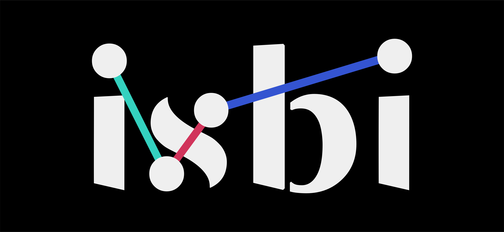

# ISBI - Insight Solutions Business Intelligence

**Business Intelligence sob medida para PMEs brasileiras.**
Implementação e acompanhamento contínuo. Sem caixa preta.

---

## Sobre

Somos analistas, engenheiros e desenvolvedores de dados. Ajudamos pequenas e médias empresas brasileiras a saírem de planilhas soltas e relatórios manuais para uma base de dados sólida, com dashboards que respondem perguntas de negócio, não só bonitos de olhar.

Trabalhamos com um modelo de serviço gerenciado: uma implementação inicial (modelagem, pipelines, dashboards) seguida de uma mensalidade que cobre manutenção, evolução e suporte. A ideia é que o cliente tenha um time de dados terceirizado, não um projeto que morre depois da entrega.

Somos uma empresa aberta por princípio. Código, arquitetura e boa parte do processo de construção ficam públicos aqui. Isso gera confiança técnica com quem vai contratar e serve de referência para outros times de BI resolvendo os mesmos problemas.

## Como trabalhamos

1. **Diagnóstico**: mapeamento das fontes de dados existentes (ERP, planilhas, sistemas internos) e das perguntas de negócio que ainda não têm resposta.
2. **Implementação**: pipeline de dados, modelagem e primeiros dashboards.
3. **Acompanhamento**: evolução contínua, novos relatórios, ajustes de modelo, suporte direto.

## Repositórios

| Repositório | Descrição |
|---|---|
| [`insight-solutions-stack`](https://github.com/isbigroup/insight-solutions-stack) | Template de infraestrutura de dados por cliente (Airbyte, dbt, Metabase, Dagster) |

## Entrar em contato

Interessado em conversar sobre BI para o seu negócio? Fale com a gente pelo [LinkedIn](https://www.linkedin.com/company/isbigroup/?viewAsMember=true).

---

Construído em público. Feedback e contribuições são bem-vindos.

